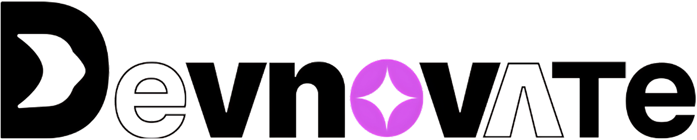

# 🌐 Devnovate - Home Page Project  

  

A modern, responsive homepage for **Devnovate Co.** built with **Next.js** and the **MERN stack**. 🚀  

---

## 📖 Project Overview  
This project aims to create a stunning homepage that showcases our services and capabilities with a clean, responsive UI.  

---

## 🛠 Tech Stack  
- **Frontend**: Next.js, React  
- **Backend**: Node.js  
- **Database**: Not used currently  
- **Deployment**: Cloudflare Pages  

---

## 📋 Current Progress  

✅ Hero component with Navbar – *Credits: Kedar S.*  
✅ Footer component – *Credits: Shiva*  
✅ Services / Features section *(in progress, not yet deployed)*  
✅ Fully responsive design  
⚠️ Signup page created *(not connected to backend & not yet deployed)*  

---

## 🌐 Deployment  
The application is currently live at:  
🔗 [https://dev.devno.pages.dev/](https://dev.devno.pages.dev/)  

Deployment uses **Cloudflare** for partial CI/CD, real-time traffic, and performance optimization simulations.  

---
